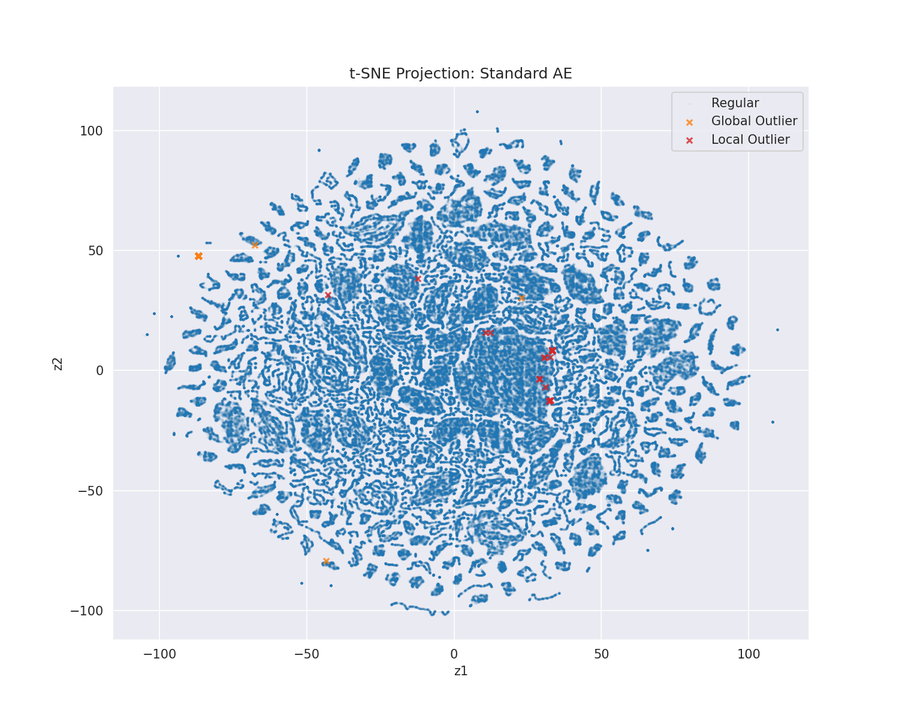

# Analisi Qualitativa (t-SNE)

L'algoritmo t-SNE (t-Distributed Stochastic Neighbor Embedding) fornisce un riscontro visivo ai risultati numerici precedenti, proiettando lo spazio latente a 10 dimensioni in un piano 2D per ispezionare la topologia dei cluster formati.

### La "Pistola Fumante"
Il confronto tra le visualizzazioni dello spazio latente dell'AAE e dello Standard AE offre la spiegazione più convincente per la differenza di performance osservata (la "Smoking Gun").

#### Spazio Latente AAE

Osservando il plot t-SNE generato dall'AAE, si nota immediatamente l'effetto dominante della regolarizzazione avversaria. I dati (sia leciti che fraudolenti) sono costretti a formare una nuvola compatta e sferica, che rispecchia la distribuzione Prior Gaussiana imposta.
Sebbene esteticamente ordinata, questa compressione forzata ha un effetto collaterale distruttivo: le transazioni fraudolente (punti rossi) risultano spesso "annegate" o sovrapposte ai bordi dei cluster di transazioni lecite (punti blu). Il Discriminatore, nel suo tentativo di rendere indistinguibile l'output dell'Encoder dalla Prior, ha finito per eliminare quelle sottili irregolarità che caratterizzavano le frodi.

#### Spazio Latente Standard AE

Al contrario, il plot relativo allo Standard AE mostra una struttura molto più frastagliata e irregolare. Senza il vincolo di dover assomigliare a una Gaussiana, la rete è stata libera di organizzare lo spazio latente seguendo le varietà (manifold) naturali dei dati.
Il risultato è evidente: i punti rossi (frodi) tendono a formare piccoli cluster isolati o filamenti periferici ben distanziati dalla massa centrale delle transazioni lecite. Questa separazione topologica naturale ("Manifold Unfolding") è ciò che permette alla Random Forest di tracciare confini decisionali netti e ottenere quel +1.5% di MAUC.

### Conclusione Visuale
Le immagini confermano che, nel contesto della rilevazione frodi su questo dataset, l'**over-regularization** è un nemico. La complessità dell'AAE ha risolto un problema che non esisteva (la regolarità dello spazio latente), peggiorando invece la soluzione al problema reale (la separabilità delle anomalie).
