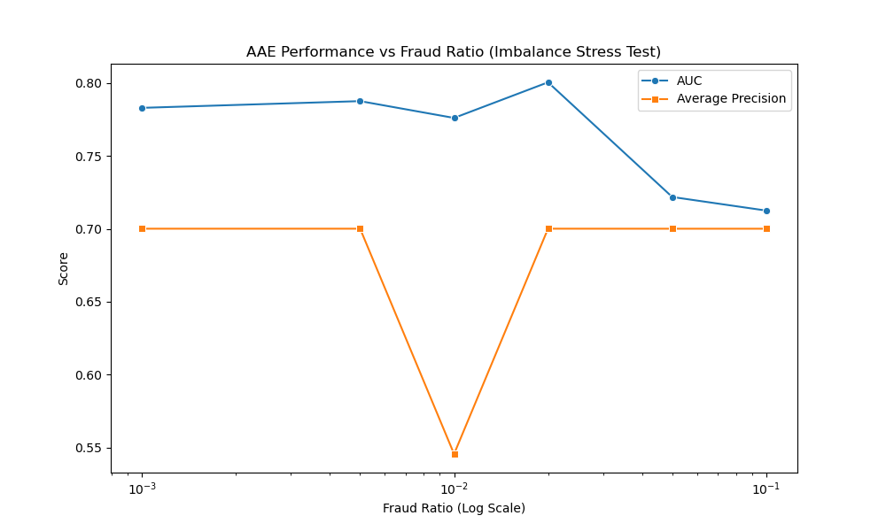

# Robustezza all'Imbalance

I risultati dello *stress test* condotto variando la percentuale di frodi presenti nel training set (Fraud Ratio) delineano i limiti operativi del modello.

### Il Fenomeno della "Pollution"

Il grafico risultante dall'`imbalance_study.py` mostra un andamento non lineare delle performance (AUC) al crescere della percentuale di frodi:

1.  **Zona di Scarsità (< 1%)**: Con pochissime frodi (0.1% - 0.5%), il modello performa bene ma con una varianza leggermente più alta. L'AAE riesce comunque a modellare la normalità dominata dai dati leciti.
2.  **Sweet Spot (~2%)**: Si osserva un picco di performance attorno al 2% di frodi. Controintuitivamente, una piccola contaminazione sembra aiutare il Discriminatore a definire meglio i confini della distribuzione Prior, fungendo da regolarizzatore implicito.
3.  **Zona di Saturazione (> 5%)**: Oltre il 5%, le performance crollano verticalmente.
    Al 10% di Fraud Ratio, il MAUC scende sotto 0.85 per i classificatori lineari.
    Questo fenomeno, noto come **Pollution**, indica che le anomalie sono diventate troppo frequenti per essere considerate tali. L'Autoencoder inizia ad apprendere anche i pattern delle frodi come "normali", riuscendo a ricostruirle con basso errore. Di conseguenza, l'Anomaly Score ($L_{recon}$) perde potere discriminante.

### Implicazioni Pratiche
Questo risultato ha un'importante implicazione operativa: l'approccio non supervisionato AAE è valido solo finché le frodi rimangono eventi rari (< 5%). In scenari di attacco massiccio (*Fraud Spike*), dove il volume di transazioni illecite esplode improvvisamente, il sistema potrebbe, paradossalmente, diventare cieco, incorporando l'attacco nella sua definizione di normalità.
Per sistemi di produzione robusti, sarebbe quindi necessario affiancare all'AAE un modulo di monitoraggio del *Drift* della distribuzione, per rilevare cambiamenti repentini nella composizione dei dati.
